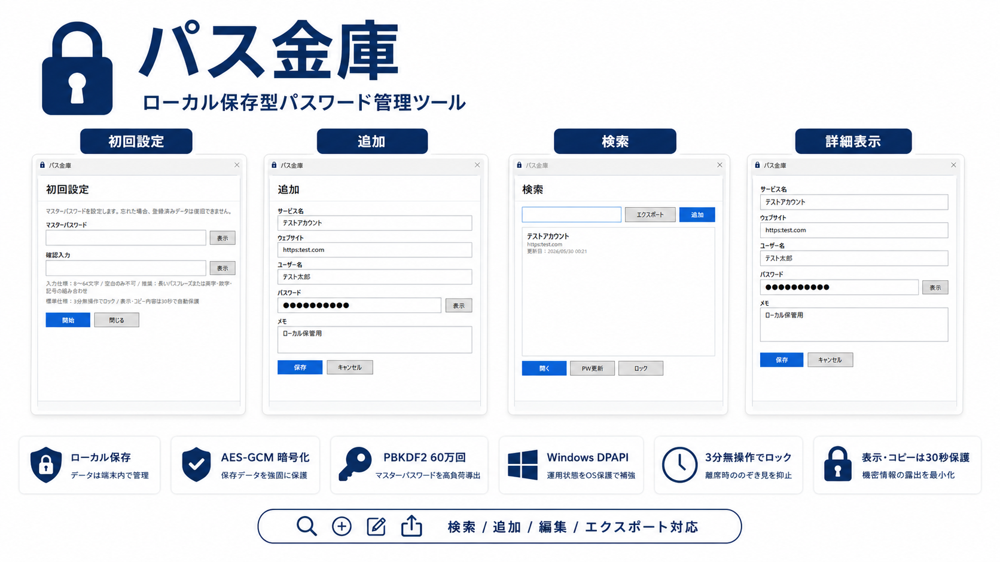

# パス金庫


ローカルPC上で資格情報を管理する、Windows向けのパスワード管理ツールです。

登録したデータは利用者のPC内に保存され、開発者のサーバーや外部サービスへ自動送信する機能はありません。



## 概要

パス金庫は、サービス名、ウェブサイト、ユーザー名、パスワード、メモなどの資格情報を、利用者のWindows PC内で管理するためのツールです。

登録データはローカル保存されます。クラウド同期、広告配信、アクセス解析、開発者サーバーへの自動送信は行いません。

## 特徴

- ローカルPC内で資格情報を保存
- マスターパスワードによるロック解除
- Windows Helloによるロック解除設定
- ウェブサイトの複数登録
- ユーザー名、パスワード、ウェブサイトのコピー
- ウェブサイトを既定ブラウザで開く機能
- CSV出力
- `.pkbk` 形式のバックアップ作成と復元
- タスクトレイ常駐
- 削除前の確認メッセージ
- 初期化時のデータ退避
- 複数サイズ入りの高解像度アプリアイコン

## 動作環境

本ツールは、Windows環境向けです。

- Windows 10 / Windows 11
- .NET 8 Desktop Runtime

起動できない場合は、`.NET 8 Desktop Runtime` がPCに入っていない可能性があります。

## ダウンロード

最新版は GitHub Releases からダウンロードしてください。

[パス金庫 V002.000.000 をダウンロード](https://github.com/takumiappdev-rgb/PassKinko/releases/tag/V002.000.000)

ダウンロードするファイルは以下です。

```text
PassKinko_V002.000.000_Windows.zip
```

GitHub上に表示される `Source code (zip)` や `Source code (tar.gz)` は開発者向けのソースコードです。通常利用する場合は不要です。

## 使い方

### 1. ZIPをダウンロードする

GitHub Releases から以下をダウンロードします。

```text
PassKinko_V002.000.000_Windows.zip
```

### 2. ZIPを展開する

任意の場所にZIPを展開します。

例:

```text
C:\Tools\PassKinko\
C:\Users\ユーザー名\Documents\PassKinko\
D:\Apps\PassKinko\
```

### 3. アプリを起動する

展開したフォルダ内の以下を起動します。

```text
パス金庫.exe
```

初回起動時に、マスターパスワードを設定します。

## 残しておく必要があるファイル

`パス金庫.exe` だけを取り出して使わないでください。

展開したフォルダ内の以下のファイル・フォルダ一式が必要です。

```text
パス金庫.exe
パス金庫.dll
パス金庫.deps.json
パス金庫.runtimeconfig.json
Assets\
```

これらを同じフォルダに置いたまま `パス金庫.exe` を起動してください。

## 保存先

登録データや設定ファイルは、以下の場所に保存されます。

```text
%LOCALAPPDATA%\PassKinko\
```

実際の例:

```text
C:\Users\ユーザー名\AppData\Local\PassKinko\
```

主な保存ファイルは以下です。

```text
settings.json
passkinko.db
```

GitHubで配布しているZIPには、利用者のローカルデータ、テストデータ、保存済みパスワードは含まれていません。

## バックアップ

本バージョンのバックアップは、`settings.json` と暗号化済みDBをまとめた `.pkbk` 形式です。

PC移行時も、正しいマスターパスワードがあれば復元できます。

ただし、バックアップファイルの保管場所や共有方法には十分注意してください。

## CSV出力について

CSV出力には、ユーザー名、ID、パスワード、メモ等が平文で含まれる可能性があります。

移行や確認が完了したら、不要なCSVファイルは速やかに削除してください。

## 初回起動時の注意

本アプリは個人開発の未署名アプリです。

初回起動時に Microsoft Defender SmartScreen により、以下のような警告が表示される場合があります。

```text
Windows によって PC が保護されました
発行元: 不明な発行元
```

GitHub Release からダウンロードしたZIPであることを確認したうえで、利用を継続するか判断してください。

## ×ボタンの動作について

画面右上の × ボタンを押しても、アプリは完全終了せず、タスクトレイに常駐します。

再度 `パス金庫.exe` を起動すると、既に起動中の画面が前面に表示されます。

完全に終了したい場合は、タスクトレイのアイコンから終了してください。

## マスターパスワードを忘れた場合

安全上、登録済みデータの復号はできません。

ただし、ツール自体は「退避して新規開始」により再利用できます。退避データは削除されません。

## 旧データが残っている場合

旧形式、破損、互換性なしのデータが残っていても、アプリは起動して「アクセス停止」または「ロック解除」画面を表示します。

画面上で以下の復旧方針を選べます。

- バックアップ復元
- 退避して新規開始

「退避して新規開始」は既存ファイルを削除せず、`quarantine_...` フォルダへコピー退避してから初期状態へ戻します。

## 更新履歴

### V002.000.000

- ウェブサイトを複数登録できるようにしました。
- 削除ボタンを押し間違えにくい位置へ移動し、削除前に確認メッセージを表示するようにしました。
- ロック解除画面のボタン配置を調整しました。
- 検索画面に「設定」を追加しました。
- マスターパスワード更新、エクスポート、初期化、Windows Hello設定を設定画面にまとめました。
- 初期化時はマスターパスワード入力を必須にし、既存データを退避してから初期状態へ戻すようにしました。
- Windows Helloでロック解除できる設定を追加しました。
- アプリアイコンを複数サイズ入りの高解像度アイコンへ更新しました。
- マスターパスワードの鍵導出処理を強化しました。

### V001.000.000

- 初回リリース。
- ロック解除、追加、検索、詳細表示、編集、削除に対応。
- CSV出力、バックアップ作成、バックアップ復元に対応。
- タスクトレイ常駐に対応。

## 開発者向け

開発環境で起動する場合は以下を実行します。

```powershell
.\run_dev.bat
```

リリースビルドを作成する場合は以下を実行します。

```powershell
.\build_release.bat
```

出力先:

```text
RELEASE\PassKinko_V002.000.000\
```

GitHub Releasesへ添付するファイル:

```text
PassKinko_V002.000.000_Windows.zip
```

## プライバシー・免責について

本アプリは、ローカルPC上で資格情報を管理するためのツールです。

登録されたサービス名、ユーザー名、ID、パスワード、メモ等を、開発者のサーバーまたは外部サービスへ自動送信する機能はありません。

ただし、パスワード管理には情報漏えい、紛失、盗難、誤操作、復旧不能等のリスクがあります。本アプリは、登録情報の完全な保護、漏えい防止、不正利用防止、復旧可能性を保証するものではありません。

CSV出力、バックアップファイル、クリップボード、スクリーンショット、画面共有、クラウド保存等の管理は、ユーザー自身の責任で行ってください。

詳細は [プライバシーポリシー・利用条件](./PRIVACY_POLICY.md) を確認してください。

## ライセンス

MIT License
